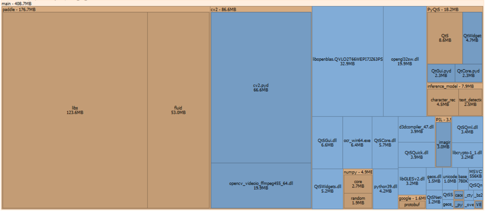

# "paddlepaddle" Clean OCR

 A clean version of "paddlepaddle" OCR


## Introduction

A Windows GUI to perform optical character recognition, using "paddlepaddle" 
OCR models. With this program, users can recognize text included in images 
from both the clipboard and the file system.

Currently, support
- Language: Chinese, English
- Format of images: `*.png`, `*.jpg`

## Citation

All used packages are listed in `requirements.txt`. 

Specially, `paddlepaddle` are disassembled and separately used. The OCR models
(in `inference_models` folder included in source code and released program)
and `*.dll` binary files (in `paddle/libs` folder included in released program)
are provided by "paddlepaddle". Therefore, **ONLY IF YOU TRUST** 
"paddlepaddle", can you use files (both source code and released program)
in this repository.

## Usage

### 1. For compiling

Follow these steps to compile an *.exe file on Windows 10 64-bit platform.

(1) Make some modifications in `paddlepaddle` package, which are listed below.

|             |                                                     |
|-------------|-----------------------------------------------------|
| File path   | `paddle/fluid/proto/pass_desc_pb2.py`               |
| Line number | 16                                                  |
| From        | ```import framework_pb2 as framework__pb2```        |
| To          | ```from . import framework_pb2 as framework__pb2``` |

|             |                           |
|-------------|---------------------------|
| File path   | `paddle/dataset/image.py` |
| Line number | 39-62                     |
| From        | code 1.                   |
| To          | `import cv2`              |

```python
if six.PY3:
    import subprocess
    import sys
    import os
    interpreter = sys.executable
    # Note(zhouwei): if use Python/C 'PyRun_SimpleString', 'sys.executable'
    # will be the C++ execubable on Windows
    if sys.platform == 'win32' and 'python.exe' not in interpreter:
        interpreter = sys.exec_prefix + os.sep + 'python.exe'
    import_cv2_proc = subprocess.Popen(
        [interpreter, "-c", "import cv2"],
        stdout=subprocess.PIPE,
        stderr=subprocess.PIPE)
    out, err = import_cv2_proc.communicate()
    retcode = import_cv2_proc.poll()
    if retcode != 0:
        cv2 = None
    else:
        import cv2
else:
    try:
        import cv2
    except ImportError:
        cv2 = None
```
Code 1. The original code that `paddlepaddle` imports `cv2`.

Note: The file path should start with the path to site packages. For example, 
`venv\Lib\site-packages` or `~/.conda/envs/.../Lib/site-packages`.

(2) Start the command line and make the current folder as the project root 
directory. Then, run the following command:

```
pyinstaller main.spec 
Xcopy /E /I inference_model dist\main\inference_model
```

(3) Create a shortcut for `dist\main\ocr_win64.exe`, which is the main program.

### 2. For directly using

Download the latest release of this repository, unzip and run it.

The program's disk space usage is indicated as Figure 1.



Figure 1. The program's disk space usage.
