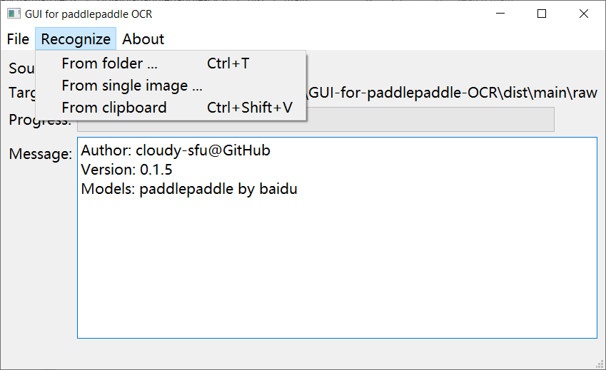

# GUI for `paddlepaddle` OCR

 The GUI for `paddlepaddle` OCR


## Introduction

A Windows GUI to perform optical character recognition using `paddlepaddle` OCR models. With this program, users can recognize text included in images from both the clipboard and the file system.

Support recognizes Chinese and Latin characters from  `*.png` and `*.jpg` images.

<details>
 <summary><b>Screenshot</b></summary>
 
</details>


## Usage

**Release:**

1. Download and unzip the latest release.
2. Run `GUI-for-paddlepaddle-OCR.exe`.

**Compile from source code:**

Assume the current directory in the terminal is the root directory of this program. Denote the virtual environment of Python is defined in Line 1 in `fix_env_win.bat`. By default, I set `VENV=.\venv`, which means the virtual environment is installed at `VENV/` relative to the root directory of this program. This variable can be modified according to the user's environment.

Run the following commands in the terminal:

```
pip install -r requirements.txt
fix_env_win.bat
pyinstaller main.spec
```

If you have the following warnings:

```
paddlepaddle 6848 analysis_predictor.cc:2664] Deprecated. Please use CreatePredictor instead.
```

Because you're using PaddlePaddle v2.5.1, the solution is:

1. Replace `from paddle.fluid.core import create_paddle_predictor, AnalysisConfig` with `from paddle.inference import create_predictor, Config` in the file `paddle_fluid_initialization.py` (Remember adjusting referred code.)
2. Replace `get_input_tensor` with `get_input_handle`, replace `get_output_tensor` with `get_output_handle` in the file `paddle_fluid_initialization.py`
3. Replace all `predictor.zero_copy_run()` with `predictor.run()` in files `text_detection.py` and `text_recognition.py`

## Acknowledgment

[Inference models](https://github.com/PaddlePaddle/PaddleOCR/blob/release/2.7/doc/doc_ch/ppocr_introduction.md#6-%E6%A8%A1%E5%9E%8B%E5%BA%93)

The license of this program doesn't cover `inference_models/` directory.
