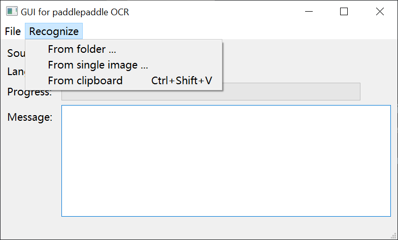

# GUI for `paddlepaddle` OCR

 The GUI for `paddlepaddle` OCR


## Introduction

A Windows GUI to perform optical character recognition using `paddlepaddle` OCR models. With this program, users can recognize text in images from the clipboard or files.

Support recognizing multiple languages' characters from  `*.png` and `*.jpg` images.

Supported languages are listed in `languages.csv`.

<details>
 <summary><b>Screenshot</b></summary>
 
</details>

## Usage

### Release

1. Download and unzip the latest release.
2. Run `GUI-for-paddlepaddle-OCR.exe`.

### Compile from source code

Download `paddle_inference.zip` corresponding to `cpu_avx_mkl` from [paddlepaddle website](https://paddleinference.paddlepaddle.org.cn/master/user_guides/download_lib.html#windows) (accessed Feb 9, 2024), unzip, and put in the program root as directory `mklml/`. The expected file structure in this directory is shown in `mklml_index`.

Run the following command:

```
pip install -r requirements.txt
pyinstaller main.spec
```

## Acknowledgment

[Inference models](https://github.com/PaddlePaddle/PaddleOCR/blob/release/2.7/paddleocr.py#L72)

<u>Our license doesn't cover files at the following locations.</u> 

```
inference_models/
paddleocr/
```

